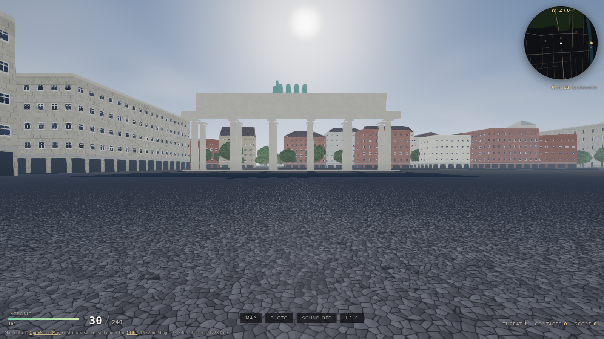
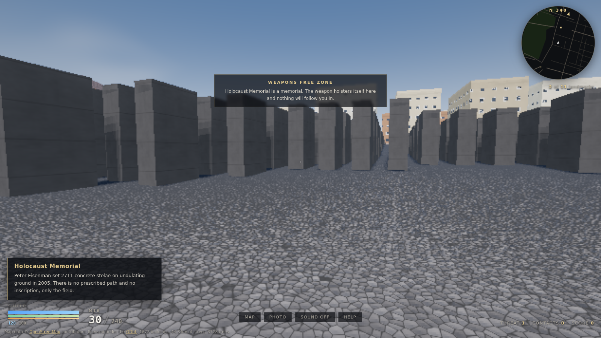
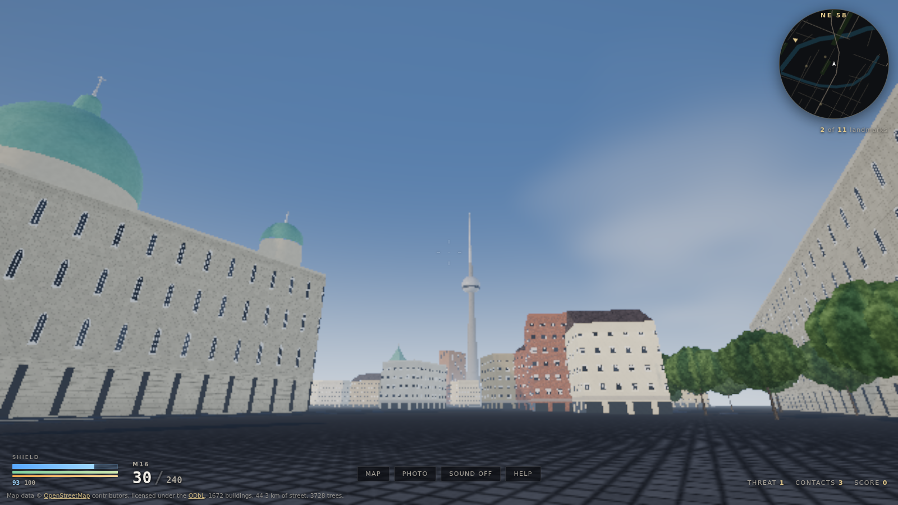
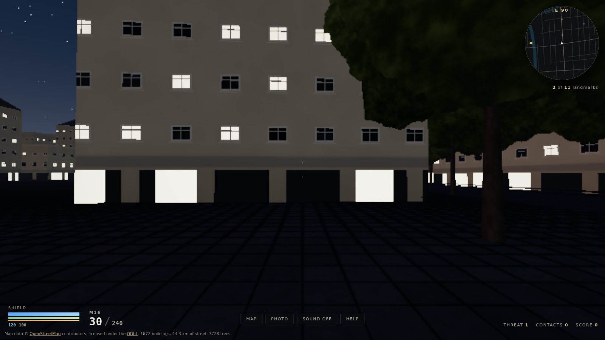
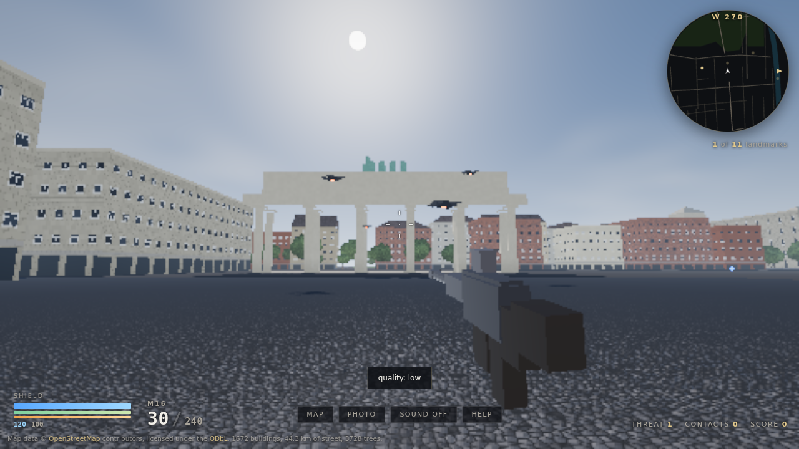
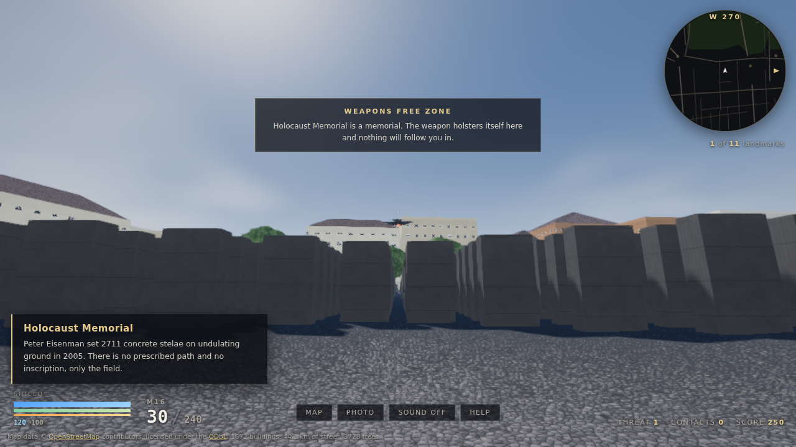
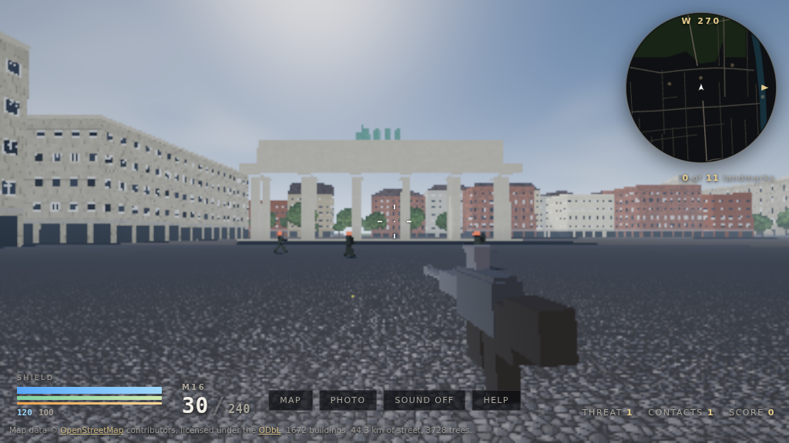
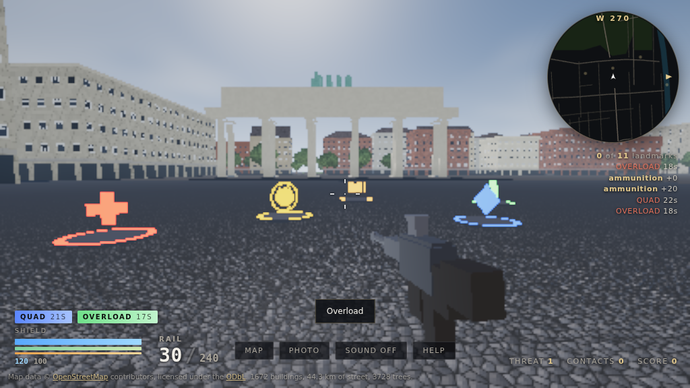

# SPREE|FALL

An open world first person shooter set in a real reconstruction of central
Berlin, running from a single link in a browser. You spawn on Pariser Platz
facing the Brandenburg Gate, and you can walk east down Unter den Linden to
Museum Island and the Fernsehturm, south to the Holocaust Memorial and Potsdamer
Platz, and north to the Reichstag and the Spree. Reconnaissance drones hunt the
same streets, and every shot is traced through the real geometry of the city, so
a column of the Gate stops a bullet exactly where the column stands.

Every building, street, path, tree, river and rail line is generated from
OpenStreetMap data by a pipeline in this repository. The renderer, the physics,
the sound and the data pipeline are all written from scratch.

**No game engine. No 3D library. No runtime dependency of any kind.**

| | |
|---|---|
| Rendering | raw WebGL2, own shaders, own matrix maths, own scene graph |
| Physics | own capsule character controller against a 2D segment world |
| Combat | own hitscan raycasting against the same world, own flight AI |
| Audio | raw Web Audio API, every sound synthesised at run time |
| Map data | OpenStreetMap, parsed and triangulated by our own code |
| Shipped as | one HTML file, JS modules, one binary bundle, no backend |
| Payload | 21.33 MB deployed, 7.90 MB over the wire with gzip, against a 25 MB budget |
| Difficulty | easy, normal and hard, with shields that come back |
| Third party code at run time | none |

## Try it

```
npm install          # only Playwright, and only for the tests and screenshots
npm run fetch        # download the OSM extract for the box, cached in data/raw/
npm run world        # build public/world.bin and public/world.json
npm run serve        # http://localhost:8080/
```

`npm run test` runs the pipeline unit tests, `npm run verify` takes the fixed
screenshots in a headless browser and fails on any console error, `npm run
test:ui` drives the whole game layer through a real browser, `npm run
test:combat` fights drones in one and checks the damage, the cover and the
weapons free zone, and `npm run clip` records the walk. `npm run build` writes a `dist/` folder that can be copied onto GitHub Pages,
Cloudflare Pages, or any static host. There is nothing to run on the server.

## Controls

| | |
|---|---|
| W A S D, arrow keys | walk |
| Shift | run |
| Space | jump onto kerbs and low walls |
| Mouse | look, with pointer lock |
| Touch | drag left to walk, drag right to look |
| Gamepad | left stick walks, right stick looks, A jumps, L3 runs |
| P | photo mode: hides the interface, unlocks the clock, saves a PNG |
| M | enlarge the map |
| N | sound on and off |
| H | help |
| 1 to 6, or the mouse wheel | M16, shotgun, rocket launcher, grenade, C4, banana |
| 7 8 9 0 | railgun, plasma rifle, flak cannon, splinter gun |
| E, or right Shift | reflexes: the city slows and you do not |
| Space while reflexes run | a leap, paid for out of the same meter |
| F5 F6 F7 | difficulty: easy, normal, hard |
| Q | back to the weapon you had before |
| T | blow the C4 you have put down |
| Left mouse, or RT on a pad | fire |
| Right mouse, or LT on a pad | aim down the sight |
| R | reload |
| G | holster the weapon, for walking and for photographs |
| F | debug overlay |
| `spreefall.debugMode(n)` in the console | 1 material, 2 normals, 3 uv, 4 world position, 5 material id, 6 detail fade, 7 view distance |
| F1 F2 F3 | quality tier: low, medium, high |

Getting within 40 m of one of the eleven landmarks slides in a card with its
name and a sentence of history. Find all eleven and you get a completion screen
with the time taken and the distance walked. The URL always carries your
position, heading and time of day, so a link opens exactly the view you were
looking at.

## Staying alive

**Shields first.** A layer over your health that takes the hit, comes back on
its own after a few seconds out of the fire, and breaks with a sound you will
learn to dread. The shot that empties it spends only what the shield had left,
so the break is a warning rather than a wound, and you get the moment after it
to find a wall.

**Three difficulties, chosen on the title screen or with F5, F6 and F7.** They
change the size of the shield, how long the quiet has to be before it comes
back, how hard everything out there hits, and how straight it shoots. On easy
your health comes back too, which is most of what makes it easy.

**Reflexes, on E.** The city drops to a third of speed and you do not: your
aim, your trigger and your feet all stay on the real clock, so a magazine goes
three times as far and a burst that was going to hit you is something you can
walk out of. The meter drains while it is on and fills when it is not.
Jumping while it runs spends a slice of it and throws you most of a storey up.

**Things lying in the street.** Thirty odd pads scattered over walkable
ground, found by asking the world where a person could actually stand rather
than by anyone authoring a list of coordinates. Run over one and it is yours;
it comes back on a timer, so the map is something you learn to move around.
Ammunition fills the weapon in your hands and tops up the rest of the loadout.
A medical kit puts fifty five back. Then the three that have a clock on them
and a chip on the interface counting it down:

| | |
|---|---|
| Quad damage | everything you fire hits four times as hard, for 22 s |
| Ultrashield | an overshield well above your normal maximum, for 26 s, then it bleeds back down rather than vanishing |
| Overload | you fire almost twice as fast and reload in under half the time, for 18 s |

None of them spawns in the weapons free zone.

## The shooter

**The targets are drones, not people.** This is a reconstruction of a real city,
with the Reichstag, the Cathedral and the Memorial to the Murdered Jews of Europe
standing where they really stand. Human targets in it would be grotesque. Flying
ones are also the more interesting problem: a quadrotor moves in three dimensions,
has to find its way around buildings it can see, and has to lose you when you
break line of sight.

**The memorial is a weapons free zone.** Within 135 m of Peter Eisenman's field
the weapon holsters itself, it will not fire, and the screen says why. No drone
spawns inside the circle, one that drifts in turns and accelerates back out, and
while you are in there none of them can see you. It is enforced in the game code
rather than in the interface, and the combat test checks each part of it.

What is under the hood:

- Shots are hitscan through the real world. `World.raycast` walks a DDA across
  the 100 m tile grid, tests the collision segments as vertical quads and then
  marches the ground height field, at about 4.3 microseconds a ray. The world is
  tested first and the drones only within that distance, so cover is not a
  special case, it is the same geometry you are standing on.
- Ten things to carry, on the number row or the mouse wheel: an M16, a pump
  shotgun that throws eleven pellets, a rocket launcher, grenades, C4 you place
  and blow with T, a banana, a railgun that goes through everyone in the line, a
  plasma rifle whose bolts bounce round a corner, a flak cannon that fills a
  doorway with shrapnel, and a splinter gun whose darts chase. The last four are
  the arena tradition, which the deathmatch shooters of the nineties built;
  the names and the numbers are ours. Each one is a row in
  `src/game/arsenal.js`, because every difference between a rifle and a shotgun
  that the game cares about is a number.
- Hold the sight on something with the launcher and it locks, and the rocket
  chases what it locked rather than where you were pointing when you fired.
- Recoil kicks and comes back. The view carries the climb as an offset and gets
  it back as the spring settles, keeping only the small share each weapon is
  allowed to keep, so a burst walks instead of stranding your aim in the sky. A
  full magazine of the M16 peaks about five degrees up and leaves two behind.
- Grenades, rockets, C4 and bananas are real objects with gravity that bounce
  off the actual walls of actual buildings, because they collide against the
  same raycast the bullets use, and against whoever is standing in the way: the
  first version of the rocket flew through the man it was aimed at and went off
  on the wall behind him. A blast damages everything inside its radius that it
  can see, including you. C4 sticks where it lands and waits.
- Drones patrol, pursue, attack and evade. They steer with four horizontal probes
  and a ground clearance term, so they do not fly into walls, and they re-test
  line of sight every 0.22 s rather than every frame, on a rota, so the cost is
  spread across frames instead of spiking whenever the sky fills up.
- Fighter jets arrive at threat three. They do not hover: one comes in from
  half a kilometre out, aims at where you are going rather than where you are,
  fires on the pass, breaks off, and comes round again in a wide turn. You
  cannot chase it, only be ready for the next run. Every second pass it drops a
  missile that chases you slowly enough that moving is an answer.
- Soldiers walk the same streets. They advance, take an angle on you, fire in
  bursts and lose you when you break line of sight, testing that line of sight
  from their eyes to yours through the real geometry. They will not walk into
  the weapons free zone. And they slip on a banana, which lays them out for
  three and a half seconds.
- Holding ground raises the threat tier, which raises how many of them are in the
  air at once, from six to fourteen. Integrity regenerates after a pause, and
  going down clears the sky, drops the threat by a tier and puts you back on
  your feet where you fell.
- Buildings take damage, and it is worth being exact about what that means.
  An explosion marks the wall it went off against: soot spreading with a ragged
  edge, the render darkened and roughened, the specular killed, and the lit
  windows inside the mark blown out. The blast also knocks debris off whatever
  surfaces are close enough, found with the same raycast the bullets use. What
  it does not do is knock the building down. The geometry is baked into the
  tile buffers at build time, so nothing here moves a wall; the city is marked,
  not demolished. The sixteen most recent marks are kept and the oldest is
  overwritten, because a fragment shader that loops over an hour of accumulated
  damage is a fragment shader nobody can afford.
- The scene is drawn into a target that shrinks when frames get expensive and
  grows back when they are cheap, between roughly half and full resolution. It
  is driven by the wall clock between frames rather than by how long our own
  draw calls took to return, because a GPU signs for the work and finishes it
  later: fed the latter, a machine at four frames a second thinks it has
  headroom. The interface never scales.
- The pads are placed once, at load, from wherever you came into the city. A
  candidate has to be inside the world, out of the memorial, clear of anything
  within arm's reach in six directions, and 45 m from every other pad; ninety
  tries per pad and whatever sticks is the map. Each is drawn as one instanced
  mesh per kind, fourteen centimetres proud of the collision height because the
  street that is drawn is not the height field that is collided against, and
  only within 260 m, where the fog has them anyway.
- Every sound is synthesised: a noise burst through a swept bandpass for the shot,
  a rotor bed whose level and pitch follow the nearest drone, and two different
  confirms for a hull hit and a core hit.

## Two cities, and which one you are looking at

The sandbox this was built in denies every OpenStreetMap host, so the local
build runs on the offline fallback described below. The deploy has no such
limit: GitHub Actions fetches the live Overpass extract on every push, and the
site at the link above is built from it. They are not the same city.

| | offline fallback | deployed, live OSM |
|---|---|---|
| Source | 1.47 MB of generated OSM XML | 22.78 MB from overpass-api.de |
| Buildings | 1,672 | 3,354 |
| Street | 44.3 km | 364.1 km |
| Trees | 3,728 | 5,582 |
| Stelae | 2,711 | 2,711 |
| Triangles | 132,397 | 413,173 |
| Payload | 9.42 MB, 2.28 MB gzipped | 21.33 MB, 7.90 MB gzipped |

Everything this project knows about Berlin that OpenStreetMap does not is in
`tools/berlin-facts.mjs`: the surveyed footprints of the landmarks, the eleven
card texts, and the size and count of the stelae. `tools/annotate.mjs` attaches
those facts to whatever extract the build was handed, and it prefers the real
feature every time. On the live extract it finds 21 of the 23 landmarks already
mapped and gives them their proper shapes on their real footprints, adds the two
it cannot find, and hangs the stelae field on the memorial outline that OSM
already draws. Only where the data has nothing does a surveyed footprint get
used as it stands.

This matters more than it sounds. Every piece of curated content rides on those
facts, including the weapons free zone: the game finds the memorial through the
landmark card, so without this pass the deployed city would have no memorial,
no stelae and no sanctuary at all, which was exactly the state of it until the
build log was read.

## What is real and what is generated

This matters, so it is spelled out rather than glossed over.

**Surveyed, from the map.** Every street centreline and its width and surface,
every landmark footprint and its height, the course of the Spree and the
Spreekanal, the outlines of the Tiergarten, the Lustgarten, Monbijoupark and the
Marx-Engels-Forum, the line of the Stadtbahn viaduct, the positions of the
station entrances, and the outline of the memorial. All in WGS84, projected to a
local metric plane centred on the Brandenburg Gate.

**Generated, from that data.** Everything you actually see. There are no
downloaded textures and no downloaded models anywhere in this project:

- Facades are generated in the fragment shader from a per building random seed
  and the building's own storey count, so a five storey block gets five rows of
  windows in its own rhythm, with shopfronts on the ground floor and lit windows
  at night. Landmarks get a separate monumental treatment: taller arched
  openings on a wider pitch and a rusticated base.
- Landmark silhouettes are assembled from primitives to match the real building:
  twelve Doric columns and the quadriga on the Gate, four corner towers and
  Foster's glass dome on the Reichstag, a copper dome and four turrets on the
  Cathedral, a tapering concrete shaft with a sphere and an antenna on the
  Fernsehturm.
- The 2711 stelae of the Holocaust Memorial are placed on Eisenman's grid inside
  the real outline, on an undulating floor sampled from smooth noise, so the
  field rises past your head as you walk into the middle of it.
- Roads draw their own lane markings, kerbs and cobblestones; water animates two
  wave trains and reflects the sky; trees are instanced billboards with a real
  trunk.
- Where the map gives a `building:colour`, that colour is used. Where it does
  not, a colour is picked from a Berlin palette of ochre, cream, grey, sandstone
  and red brick.
- Landmarks carry a clear zone, so the generated blocks cannot wall in the
  things people came to look at. Without one the Reichstag ends up behind a row
  of flats, which is exactly what happened the first time.

**The fallback, and why it exists.** `tools/fetch-osm.mjs` is a complete Overpass
client with retry and backoff, and it is what runs when a network is available.
The sandbox this project was built in denies every OpenStreetMap host at the
egress proxy, so `tools/synth-osm.mjs` exists as a fallback: it writes an OSM XML
document in exactly the same schema from a table of real, hand transcribed Berlin
coordinates in `tools/berlin-facts.mjs`, and fills the gaps between those streets
with generated perimeter blocks in the Berlin pattern. `data/raw/source.json`
records which of the two produced the cached file. Nothing downstream of the
parser can tell the difference, so pointing the pipeline at a live Overpass
response changes nothing else.

## How it is built

```
tools/
  fetch-osm.mjs      Overpass client, retry with exponential backoff, caching
  synth-osm.mjs      the offline fallback dataset, in the same OSM XML schema
  berlin-facts.mjs   the surveyed coordinate table
  osm-xml.mjs        our own OSM XML reader, one forward pass, no library
  earcut.mjs         our own ear clipping triangulator with hole support
  geometry.mjs       extrusion, roofs, ribbons, and the landmark primitives
  landmarks.mjs      the bespoke shape for each building people came to see
  terrain.mjs        the ground height field
  build-world.mjs    the whole pipeline, tiling and the binary bundle
  build-dist.mjs     produces dist/
  verify.mjs         headless screenshots and console error check
  test-ui.mjs        headless test of the game layer
  test-combat.mjs    headless test of the shooter, in a real browser
src/
  shared/            constants the pipeline and the runtime both import
  engine/            maths, GL plumbing, tile streaming, controller, input, loop,
                     and the world raycast the shooting is built on
  render/            renderer, sun position, drones, sparks and the viewmodel
  shaders/           all GLSL, as JS template strings
  game/              landmarks, minimap, audio, photo mode, intro, URL state,
                     and the shooter: drones, weapon, combat rules, effects
```

### The data format

The world is cut into 100 m by 100 m tiles. Each tile carries an interleaved
vertex buffer at 20 bytes a vertex, an index buffer, a collision blob and a tree
instance list, all inside one `world.bin`, with `world.json` listing the offsets.

```
offset  type        meaning
0       int16 x3    position, tile local, quantised at 1/64 m
6       int8  x4    normal, plus a vertex ambient occlusion term
10      uint16 x2   uv in units of 1/32 m
14      uint8       material id
15      uint8       facade palette index in the low six bits, variation above
16      uint8       storeys
17      uint8       facade flags
18      uint16      building height in 1/16 m
```

The collision blob per tile is a list of 2D segments with a vertical span, plus a
33 by 33 ground height field. The character controller only ever tests a capsule
against 2D segments, which is why it is both cheap and impossible to tunnel
through at a run.

Full architecture notes, including every deviation from the original brief and
why, are in [docs/PLAN.md](docs/PLAN.md).

## Performance

Measured numbers, not estimates. See `docs/screenshots/index.json` for the raw
capture, which the verification run writes.

### The build

```
parsed 1.47 MB of OSM: nodes 10848  ways 1759  relations 5
features: buildings 1672  roads 67  areas 1  water 2  green 7  rails 2, trees 3746
geometry: 266,195 vertices, 132,397 triangles, 1672 buildings, 2711 stelae,
          3728 trees, 44.3 km of road
tiles     646, of 34 by 19, 613 of them non empty
world.bin 9.05 MB
world.json 0.14 MB
dist      9.42 MB, 2.28 MB over the wire with gzip, against a 25 MB budget
max tile  589.5 kB, 12,141 triangles (the stelae field)
mean tile 12.1 kB
build     about one second
```

### Frame rate

The only machine available to build this had no GPU at all, so the numbers below
come from Chromium running the ANGLE SwiftShader software rasteriser, which is
roughly two orders of magnitude slower than any real graphics chip. They are
reported because they are what was actually measured, and because they set a
floor: everything below is what a pure software rasteriser managed.

| Viewpoint | triangles in view | draw calls |
|---|---|---|
| Pariser Platz | 31,459 | 125 |
| Through the Gate | 64,800 | 162 |
| Unter den Linden | 21,508 | 79 |
| Inside the stelae field | 39,274 | 46 |
| The Reichstag across the lawn | 33,521 | 75 |
| Under the Fernsehturm | 7,468 | 42 |
| Gendarmenmarkt | 16,845 | 53 |

Software rasteriser, 1600 by 900: 3 to 5 fps.

`npm run verify` also reads each frame back at 64 by 36 and describes it: how
much of it is lit, how many tones are in it, and what share of neighbouring
pixels differ enough to count as an edge. A city frame runs from 15 to 52 per
cent edges, so a frame under five per cent fails the run. This is not
decoration. The Reichstag viewpoint spent weeks pointing at the inside of a
generated building, with a wall a hundred millimetres from the camera, and the
screenshot went on being saved and never looked at. Edges rather than colour,
because a colour test does not survive a sunset or a blue grey pavement: the
first version of this check called Pariser Platz empty.

**No measurement on real hardware, and none on a phone.** The build environment
has no GPU and no device to test on, so the 60 fps on integrated graphics and
30 fps on a mid range phone that the brief asks for are unverified. What the
project does instead is make the budget explicit and keep the geometry inside it:
under 65,000 triangles and under 170 draw calls in view at any time, one draw
call per tile, no per object uniform updates beyond a tile origin, two shadow
cascades rather than four, and an automatic quality tier chosen from the measured
median frame time over the first three seconds. The shooter adds four draws to
that, whatever is happening: one instanced call for every drone in the air and
one more for their shadows, one for every spark in the world, and one for the
weapon in your hands. Anyone with a GPU can run
`npm run verify` and replace this section with real numbers.

Three things in here were found by measuring rather than by looking, and they are
worth naming because each of them was invisible until something was checked:

- Every wall was wound against its own normals, so with back face culling on the
  entire city would have been inside out. The unit test that checks a building is
  watertight caught it before a single pixel had been drawn.
- The view distance was a vertex attribute. On a square the size of Pariser Platz
  the corners are a hundred metres away, so the ground under your feet reported
  itself as ninety metres distant, which silently picked the wrong shadow cascade
  and switched off every surface texture. It is now computed per fragment.
- Procedural detail with no mip chain aliases into moire the moment a pixel
  covers more than half a feature. Every ground pattern now widens its own edges
  to the measured pixel footprint instead of being faded out by distance
  thresholds picked by eye, which were wrong at every grazing angle.

## Screenshots


*The spawn, on Pariser Platz looking west at the Gate.*


*Inside the field of 2711 stelae, on the undulating floor.*


*The Fernsehturm over the roofs, with the Cathedral dome on the left.*


*Unter den Linden after dark, with the windows lit.*


*Four drones over Pariser Platz, with the Gate behind them.*


*Inside the memorial the weapon is holstered and the screen says why.*


*Soldiers working across Pariser Platz, with a banana on the cobbles.*


*All five pads on the square: ammunition, a medical kit, quad damage,
ultrashield and overload, with two of them running on the chips bottom left.*

The rest are in [docs/screenshots](docs/screenshots), and
[docs/media/gate-to-tower.webm](docs/media/gate-to-tower.webm) is the eleven
second walk from the Gate down Unter den Linden to the foot of the Fernsehturm.
`npm run clip` records it, straight from the page.

## Deploying

The live site is at <https://bjoern-sellnau.github.io/ld-spreefall/>.

The Pages source is **GitHub Actions**, so `.github/workflows/pages.yml` is what
publishes it. On every push it runs the unit tests, fetches a live OpenStreetMap
extract from the Overpass API, builds the world bundle and `dist/`, and deploys
that. The runners can reach Overpass, so **the deployed city is real map data**,
not the offline fallback described above. The Overpass fetch takes three to five
minutes, which is most of the run. The `Record which source was used` step prints
which dataset the build actually got, so a silent fallback cannot go unnoticed.

The other way to publish this repository is **Deploy from a branch**, where
GitHub serves the branch contents as they are and the Actions workflow never
deploys. That path needs the built bundle in the repository rather than
gitignored, which is why `public/world.bin` and `public/world.json` are committed
and there is a `.nojekyll` at the root. They are redundant now that Actions does
the deploying. They are also build output, so as long as they are kept, run
`npm run world` and commit the result after changing anything under `tools/`, or
a branch served site would go on serving the old city.

To host it anywhere else: run `npm run build` and copy `dist/`. There is no
backend, no environment variable, and no build step at the far end.

## Attribution and licence

Map data © [OpenStreetMap](https://www.openstreetmap.org/copyright) contributors,
available under the [Open Database Licence](https://opendatacommons.org/licenses/odbl/).
The attribution is shown in the page footer at all times and is burnt into every
PNG that photo mode saves, because screenshots travel further than the page does.

Any derived database produced from this data must be released under the ODbL. The
geometry in `public/world.bin` is a produced work in ODbL terms: it is generated
from OSM data and is distributed with the attribution above.

The code in this repository is offered under the MIT licence.
